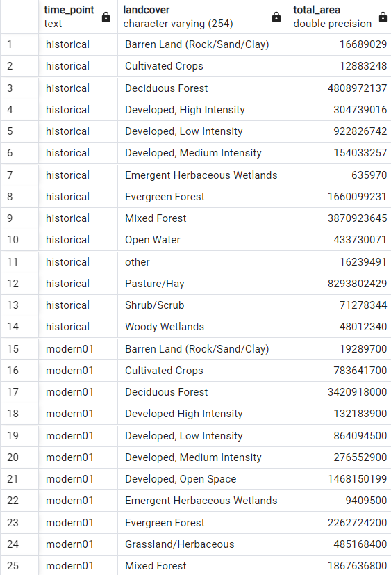
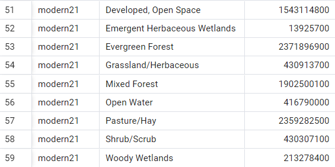

## IDCE-376_GroupProject

### Jason Andrews, Ben Gaskill, Noah Kantor
### IDCE 376, Spatial Database Management, Spring 2024
### Professor Jonathan Ocon and TA Kunal Malhan

This repository contains submissions pertaining to group project work for IDCE 376.

The assignment description can be viewed in the *Assignment_Description.pdf* document. 

Broadly, our task is to gather data related to urban expansion for a city of our choosing, and compile this into a SQL database comprising a series of related tables. 

#### Submission 1-- March 20, 2024 
The overall goal of the combined database is to relate tables containing publicly derived land cover data with satellite data indexes for our study area, across different time points. The earliest data comes from the "USGS DS 240: Enhanced Historical Land-Use and Land-Cover Data Sets of the U.S. Geological Survey," which is cited as having been collected between '1970 and 1985'. This dataset was in vector format and the attribute table already included the names of the classes. The more modern data from Multi-Resolution Land Characteristics (MRLC) consortium CONUS covers the years 2001, 2011, and 2021, this was downloaded in raster format. The Multi-Resolution Land Characteristics (MRLC) consortium is a group of US federal government agencies that consistently generates landcover imagery. To process this data we had to use the polygonize raster to vector tool in QGIS, in addition we had to add a new field for the landcover classes since the data did not automatically include it, we did this with a script referencing the legend on the data download website. Since the landcover classes in the historical and modern datasets were not exactly the same, we added a new field to update the names of the classes in the historical dataset to match the modern dataset legend categories as closely as possible. In addition, we reprojected the data to the projection ESRI:103500 and then calculated area in sq m for each class in a new area field. We will also split the data into county level, in order to understand which specific areas urbanized most rapidly and when. 

#### Study Area

We have chosen to look at the Charlotte, North Carolina, Metropolitan Statistical Area, as defined [on Wikipedia](https://en.wikipedia.org/wiki/Charlotte_metropolitan_area). This area comprises 11 counties in North Carolina and South Carolina, and was one of the fastest growing urban areas in the United States between 2000 and 2015. 

See below a visualization of this 11 county study area:

#### Tables

The following is an example of a table that we will have to normalize to remove partial dependencies:

| Date   | County Name   | NDVI Threshold Percent | Classified Urban Land Use|
| -------|:------------: | -----:|---:|
| 1980   | County 1      | 40 | 44|
| 1980   | County 2      | 35 | 40 |
| 1980   | County 3      | 38 | 40 |
| 1980   | County 4      | 51 | 40 |
| 1980   | County 5      | 55 | 40 |
| 1980   | County 6      | 48 | 40 |
| 1980   | County 7      | 38 | 40 |
| 1980   | SA Average    | 40 | 40 |
| 1992   | SA Average    |   60 | 40 |
| 2001   | SA Average    |    52 | 40 |
| 2011   | SA Average    |    46 | 40 |
| 2021   | SA Average    |    58 | 40 |

#### Example Imagery

Our data sources include historic land cover data provided by USGS, and Landsat imagery at different time points. 

The following are detail images of downtown Charlotte in false color composite from 4 of our time steps.
We will calculate different spectral indices from the satellite imagery and integrate this into our database.

**1992**

**2001**

**2011**

**2021**

##### Landcover Datasets (Processed)

The following are landcover datasets in the Charlotte area.
We have classified according to the DN values specified in the metadata of the files and decriptions on the data source website
The script for the historical dataset classification can be found [here:](landcover_code_Historical.txt)
The script for the modern dataset classification can be found [here:](landcover_code_2000s.txt)
We have also calculated the relative area in Square Meters of each individual polygon record in the attribute table

**Historical Landcover (1970s - 1980s)**

**2001 Landcover**

**2011 Landcover**

**2021 Landcover**

#### Submission 2
We created a shapefile of the counties in North Carolina and South Carolina by selecting counties from two separate county boundary shapefiles to match the extent of the Charlotte metro area, then we merged these into one shapefile to clip the vector landcover files to the Charlotte metro area boundary. Before the clipping operation could be completed we had to reproject the files so that the projection matched. After we obtained the clipped shapefiles, we uploaded our vector and raster files to a postgres database using QGIS's GUI. The steps we followed to do this were:

open postgreSQL menu in browser
click new connection, fill out the form to setup connection
click database at top of QGIS interface, click db manager
click postGIS, open charlotteproject, click public, click import layer/file
leave import vector layer parameters default except input
before doing this make sure postGIS extension is enabled in the SQL database
Once the files were in our SQL database, we used the code in the dropcolumns.sql file to delete columns that were redundant or unnecessary for our analysis. This made it so the tables did not have unnecessary dependencies.

We then removed unnecessary columns from the tables, including extra geometries and IDs that were generated from editing and copying the file many times in QGIS.
The final result consists of five tables in the charlotteproject database. Please see below for an example of each table. There are two images for each table.

**Historical Landcover Table (section 1) (1970-1980)**&nbsp;&nbsp;&nbsp;&nbsp;&nbsp;&nbsp;&nbsp;&nbsp;&nbsp;&nbsp;&nbsp;&nbsp;&nbsp;&nbsp;&nbsp;&nbsp;&nbsp;&nbsp;&nbsp;&nbsp;&nbsp;&nbsp;&nbsp;&nbsp;&nbsp;&nbsp;&nbsp;&nbsp;&nbsp;&nbsp;&nbsp;&nbsp;&nbsp;&nbsp;&nbsp;&nbsp;&nbsp;&nbsp;**Historical Landcover Table (section 2)**
  

**2001 Landcover Table (section 1)**&nbsp;&nbsp;&nbsp;&nbsp;&nbsp;&nbsp;&nbsp;&nbsp;&nbsp;&nbsp;&nbsp;&nbsp;&nbsp;&nbsp;&nbsp;&nbsp;&nbsp;&nbsp;&nbsp;&nbsp;&nbsp;&nbsp;&nbsp;&nbsp;&nbsp;&nbsp;&nbsp;&nbsp;&nbsp;&nbsp;&nbsp;&nbsp;&nbsp;&nbsp;&nbsp;&nbsp;&nbsp;&nbsp;&nbsp;&nbsp;&nbsp;&nbsp;&nbsp;&nbsp;&nbsp;&nbsp;&nbsp;&nbsp;&nbsp;&nbsp;&nbsp;&nbsp;&nbsp;&nbsp;**2001 Landcover Table (section 2)**
  

**2011 Landcover Table (section 1)**&nbsp;&nbsp;&nbsp;&nbsp;&nbsp;&nbsp;&nbsp;&nbsp;&nbsp;&nbsp;&nbsp;&nbsp;&nbsp;&nbsp;&nbsp;&nbsp;&nbsp;&nbsp;&nbsp;&nbsp;&nbsp;&nbsp;&nbsp;&nbsp;&nbsp;&nbsp;&nbsp;&nbsp;&nbsp;&nbsp;&nbsp;&nbsp;&nbsp;&nbsp;&nbsp;&nbsp;&nbsp;&nbsp;&nbsp;&nbsp;&nbsp;&nbsp;&nbsp;&nbsp;&nbsp;&nbsp;&nbsp;&nbsp;&nbsp;&nbsp;&nbsp;&nbsp;&nbsp;&nbsp;**2011 Landcover Table (section 2)**
  

**2021 Landcover Table (section 1)**&nbsp;&nbsp;&nbsp;&nbsp;&nbsp;&nbsp;&nbsp;&nbsp;&nbsp;&nbsp;&nbsp;&nbsp;&nbsp;&nbsp;&nbsp;&nbsp;&nbsp;&nbsp;&nbsp;&nbsp;&nbsp;&nbsp;&nbsp;&nbsp;&nbsp;&nbsp;&nbsp;&nbsp;&nbsp;&nbsp;&nbsp;&nbsp;&nbsp;&nbsp;&nbsp;&nbsp;&nbsp;&nbsp;&nbsp;&nbsp;&nbsp;&nbsp;&nbsp;&nbsp;&nbsp;&nbsp;&nbsp;&nbsp;&nbsp;&nbsp;&nbsp;&nbsp;&nbsp;&nbsp;&nbsp;**2021 Landcover Table (section 2)**
  

**Charlotte Metro Area Counties (section 1)** &nbsp;&nbsp;&nbsp;&nbsp;&nbsp;&nbsp;&nbsp;&nbsp;&nbsp;&nbsp;&nbsp;&nbsp;&nbsp;&nbsp;&nbsp;&nbsp;&nbsp;&nbsp;&nbsp;&nbsp;&nbsp;&nbsp;&nbsp;&nbsp;&nbsp;&nbsp;&nbsp;**Charlotte Metro Area Counties (section 2)**
  

#### Submission 3

Our first spatial query involves summarizing landcover area for each type for each year. We then calculated the overall proportion of the landcover type for the respective year.
Please refer to the () file to view the SQL query to produce the following result:

**Summary Statistics of Landcover By Year**

