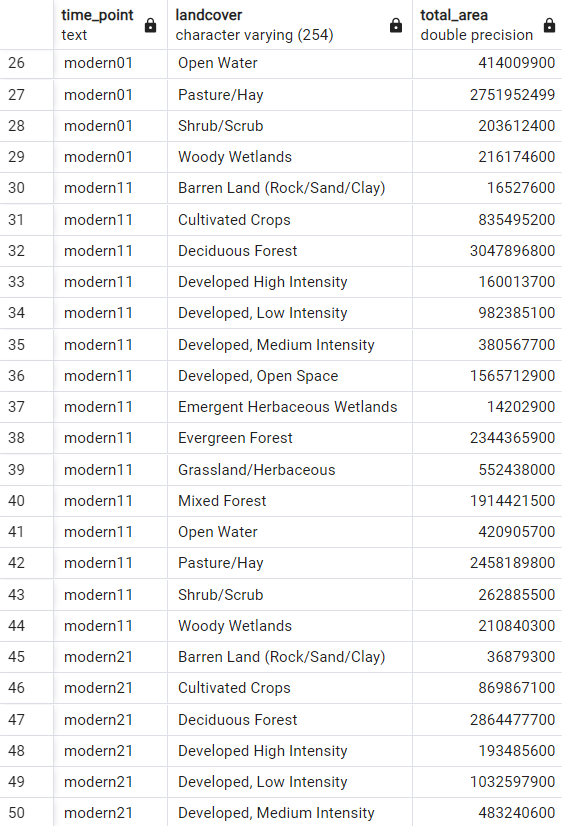

## IDCE-376_GroupProject

### Jason Andrews, Ben Gaskill, Noah Kantor
### IDCE 376, Spatial Database Management, Spring 2024
### Professor Jonathan Ocon and TA Kunal Malhan

This repository contains submissions pertaining to group project work for IDCE 376.

The assignment description can be viewed in the *Assignment_Description.pdf* document. 

Broadly, our task is to gather data related to urban expansion for a city of our choosing, and compile this into a SQL database comprising a series of related tables. 


#### Submission 1-- March 20, 2024 
The overall goal of the combined database is to relate tables containing publicly derived land cover data with satellite data indices for our study area, across different time points. The earliest data comes from the "USGS DS 240: Enhanced Historical Land-Use and Land-Cover Data Sets of the U.S. Geological Survey," which is cited as having been collected between '1970 and 1985'. This dataset was in vector format and the attribute table already included the names of the classes. The more modern data from Multi-Resolution Land Characteristics (MRLC) consortium CONUS covers the years 2001, 2011, and 2021, this was downloaded in raster format. The Multi-Resolution Land Characteristics (MRLC) consortium is a group of US federal government agencies that consistently generates landcover imagery. To process this data we had to use the polygonize raster to vector tool in QGIS, in addition we had to add a new field for the landcover classes since the data did not automatically include it, we did this with a script referencing the legend on the data download website. Since the landcover classes in the historical and modern datasets were not exactly the same, we added a new field to update the names of the classes in the historical dataset to match the modern dataset legend categories as closely as possible. In addition, we reprojected the data to the projection ESRI:103500 and then calculated area in sq m for each class in a new area field. We will also split the data into county level, in order to understand which specific areas urbanized most rapidly and when. 

#### Study Area

We have chosen to look at the Charlotte, North Carolina, Metropolitan Statistical Area, as defined [on Wikipedia](https://en.wikipedia.org/wiki/Charlotte_metropolitan_area). This area comprises 11 counties in North Carolina and South Carolina, and was one of the fastest growing urban areas in the United States between 2000 and 2015. 

See below a visualization of this 11 county study area:


## Data

Our data sources include historic land cover data provided by USGS, and Landsat imagery at different time points. 

#### Raster Imagery

NDBI and LST from each of 5 time points: 1984, 1992, 2001, 2011, 2020

These images were aquired with PySTAC. 
Each is a median composite image between March 15 and September 15 of the chosen year. 
See **Get_Images.ipynb**.

All were reprojected from EPSG 32617 to 4326

Examples:

**NDBI 1984**


**NDBI 2020**


**Script to import raster data:**


##### Landcover Datasets (Processed)

The following are landcover datasets in the Charlotte area.
We have classified according to the DN values specified in the metadata of the files and descriptions on the data source website
The script for the historical dataset classification can be found [here:](landcover_code_Historical.txt)
The script for the modern dataset classification can be found [here:](landcover_code_2000s.txt)
We have also calculated the relative area in Square Meters of each individual polygon record in the attribute table

**Historical Landcover (1970s - 1980s)**


**2001 Landcover**


**2011 Landcover**


**2021 Landcover**


#### Submission 2
We created a shapefile of the counties in North Carolina and South Carolina by selecting counties from two separate county boundary shapefiles to match the extent of the Charlotte metro area, then we merged these into one shapefile to clip the vector landcover files to the Charlotte metro area boundary. Before the clipping operation could be completed we had to reproject the files so that the projection matched. 

**2021 Landcover Clipped to County Polygons**


After we obtained the clipped shapefiles, we uploaded our vector and raster files to a postgres database using QGIS's GUI. The steps we followed to do this were:

1. open postgreSQL menu in browser
2. click new connection, fill out the form to setup connection
3. click database at top of QGIS interface, click db manager
4. click postGIS, open charlotteproject, click public, click import layer/file
5. leave import vector layer parameters default except input
6. before doing this make sure postGIS extension is enabled in the SQL database
7. Once the files were in our SQL database, we used the code in the dropcolumns.sql file to delete columns that were redundant or unnecessary for our analysis. This made it so the tables did not have unnecessary dependencies. See below:

```SQL
ALTER TABLE historical
DROP COLUMN fid_, DROP COLUMN lucode, DROP COLUMN landcover, DROP COLUMN shape_leng, DROP COLUMN shape_le_1, DROP COLUMN shape_area;
ALTER TABLE modern01
DROP COLUMN fid_, DROP COLUMN fid_1, DROP COLUMN dn, DROP COLUMN shape_leng,  DROP COLUMN shape_area;
ALTER TABLE modern11
DROP COLUMN fid_, DROP COLUMN fid_1, DROP COLUMN dn, DROP COLUMN shape_leng,  DROP COLUMN shape_area;
ALTER TABLE modern21
DROP COLUMN fid_, DROP COLUMN fid_1, DROP COLUMN dn, DROP COLUMN shape_leng,  DROP COLUMN shape_area;
```

We then removed unnecessary columns from the tables, including extra geometries and IDs that were generated from editing and copying the file many times in QGIS.
The final result consists of five tables in the charlotteproject database. Please see below for an example of each table. There are two images for each table.

**Historical Landcover Table (section 1) (1970-1980)**&nbsp;&nbsp;&nbsp;&nbsp;&nbsp;&nbsp;&nbsp;&nbsp;&nbsp;&nbsp;&nbsp;&nbsp;&nbsp;&nbsp;&nbsp;&nbsp;&nbsp;&nbsp;&nbsp;&nbsp;&nbsp;&nbsp;&nbsp;&nbsp;&nbsp;&nbsp;&nbsp;&nbsp;&nbsp;&nbsp;&nbsp;&nbsp;&nbsp;&nbsp;&nbsp;&nbsp;&nbsp;&nbsp;**Historical Landcover Table (section 2)**
  

**2001 Landcover Table (section 1)**&nbsp;&nbsp;&nbsp;&nbsp;&nbsp;&nbsp;&nbsp;&nbsp;&nbsp;&nbsp;&nbsp;&nbsp;&nbsp;&nbsp;&nbsp;&nbsp;&nbsp;&nbsp;&nbsp;&nbsp;&nbsp;&nbsp;&nbsp;&nbsp;&nbsp;&nbsp;&nbsp;&nbsp;&nbsp;&nbsp;&nbsp;&nbsp;&nbsp;&nbsp;&nbsp;&nbsp;&nbsp;&nbsp;&nbsp;&nbsp;&nbsp;&nbsp;&nbsp;&nbsp;&nbsp;&nbsp;&nbsp;&nbsp;&nbsp;&nbsp;&nbsp;&nbsp;&nbsp;&nbsp;**2001 Landcover Table (section 2)**
  

**2011 Landcover Table (section 1)**&nbsp;&nbsp;&nbsp;&nbsp;&nbsp;&nbsp;&nbsp;&nbsp;&nbsp;&nbsp;&nbsp;&nbsp;&nbsp;&nbsp;&nbsp;&nbsp;&nbsp;&nbsp;&nbsp;&nbsp;&nbsp;&nbsp;&nbsp;&nbsp;&nbsp;&nbsp;&nbsp;&nbsp;&nbsp;&nbsp;&nbsp;&nbsp;&nbsp;&nbsp;&nbsp;&nbsp;&nbsp;&nbsp;&nbsp;&nbsp;&nbsp;&nbsp;&nbsp;&nbsp;&nbsp;&nbsp;&nbsp;&nbsp;&nbsp;&nbsp;&nbsp;&nbsp;&nbsp;&nbsp;**2011 Landcover Table (section 2)**
  

**2021 Landcover Table (section 1)**&nbsp;&nbsp;&nbsp;&nbsp;&nbsp;&nbsp;&nbsp;&nbsp;&nbsp;&nbsp;&nbsp;&nbsp;&nbsp;&nbsp;&nbsp;&nbsp;&nbsp;&nbsp;&nbsp;&nbsp;&nbsp;&nbsp;&nbsp;&nbsp;&nbsp;&nbsp;&nbsp;&nbsp;&nbsp;&nbsp;&nbsp;&nbsp;&nbsp;&nbsp;&nbsp;&nbsp;&nbsp;&nbsp;&nbsp;&nbsp;&nbsp;&nbsp;&nbsp;&nbsp;&nbsp;&nbsp;&nbsp;&nbsp;&nbsp;&nbsp;&nbsp;&nbsp;&nbsp;&nbsp;&nbsp;**2021 Landcover Table (section 2)**
  

**Charlotte Metro Area Counties (section 1)** &nbsp;&nbsp;&nbsp;&nbsp;&nbsp;&nbsp;&nbsp;&nbsp;&nbsp;&nbsp;&nbsp;&nbsp;&nbsp;&nbsp;&nbsp;&nbsp;&nbsp;&nbsp;&nbsp;&nbsp;&nbsp;&nbsp;&nbsp;&nbsp;&nbsp;&nbsp;&nbsp;**Charlotte Metro Area Counties (section 2)**
  

#### Submission 3
##### Part 1
Our first spatial query involves summarizing landcover area for each type for each year. We then calculated the overall proportion of the landcover type for the respective year.
See the () script below to view the SQL query.

```SQL
Create a table named landcoverSummary
CREATE TABLE landcoverSummary AS 
-- Select time_point, landcover, total_area, and proportion
SELECT 
    time_point, 
    landcover, 
    SUM(area_sq_m) AS total_area
FROM (
    -- Subquery to combine data from all time points and calculate the sum of areas for each landcover type
    SELECT 
        'historical' AS time_point, 
        landcover, 
        SUM(area_sq_m) AS area_sq_m 
    FROM historical 
    GROUP BY landcover 
    UNION ALL 
    SELECT 
        'modern01' AS time_point, 
        landcover, 
        SUM(area_sq_m) AS area_sq_m 
    FROM modern01 
    GROUP BY landcover 
    UNION ALL 
    SELECT 
        'modern11' AS time_point, 
        landcover, 
        SUM(area_sq_m) AS area_sq_m 
    FROM modern11 
    GROUP BY landcover 
    UNION ALL 
    SELECT 
        'modern21' AS time_point, 
        landcover, 
        SUM(area_sq_m) AS area_sq_m 
    FROM modern21 
    GROUP BY landcover
) AS all_landcover_areas 
-- Group the results by time_point and landcover
GROUP BY time_point, landcover;
```

**Summary Statistics of Landcover By Year**



##### Part 2
Our second spatial query involves summarizing landcover percent area cover for each landcover type and year. This allows us to see the exact percentage of area for each landcover type in the landscape per year. 
See the () script below to view the SQL query.

```SQL
CREATE TABLE landcover_by_year AS 
SELECT 
    time_point, 
    landcover, 
	
	CASE time_point
		WHEN 'historical' THEN  
			(SUM(area_sq_m) / (
				SELECT SUM(area_sq_m) 
				FROM (
					SELECT area_sq_m FROM historical 
				) AS all_landcover_areas
			) * 100) 
		END AS percent_cover_historical,
					
	CASE time_point	
		WHEN 'modern01' THEN  
			(SUM(area_sq_m) / (
				SELECT SUM(area_sq_m) 
				FROM (
					SELECT area_sq_m FROM modern01 
				) AS all_landcover_areas
			) * 100)
		END AS percent_cover_2001,
					
	CASE time_point			
		WHEN 'modern11' THEN  
			(SUM(area_sq_m) / (
				SELECT SUM(area_sq_m) 
				FROM (
					SELECT area_sq_m FROM modern11 
				) AS all_landcover_areas
			) * 100) 
		END AS percent_cover_2011,
					
	CASE time_point			
		WHEN 'modern21' THEN  
			(SUM(area_sq_m) / (
				SELECT SUM(area_sq_m) 
				FROM (
					SELECT area_sq_m FROM modern21 
				) AS all_landcover_areas
			) * 100) 
		END	AS percent_cover_2021	
FROM (
    SELECT 
        'historical' AS time_point, 
        landcover, 
        SUM(area_sq_m) AS area_sq_m 
    FROM historical 
    GROUP BY landcover 
    UNION ALL 
    SELECT 
        'modern01' AS time_point, 
        landcover, 
        SUM(area_sq_m) AS area_sq_m 
    FROM modern01 
    GROUP BY landcover 
    UNION ALL 
    SELECT 
        'modern11' AS time_point, 
        landcover, 
        SUM(area_sq_m) AS area_sq_m 
    FROM modern11 
    GROUP BY landcover 
    UNION ALL 
    SELECT 
        'modern21' AS time_point, 
        landcover, 
        SUM(area_sq_m) AS area_sq_m 
    FROM modern21 
    GROUP BY landcover
) AS all_landcover_areas 
GROUP BY time_point, landcover;
```

**Landcover percentages by year**


**Initial Results of Change**

Historical
1. Forest (deciduous, evergreen, mixed): 50%
2. Agriculture (cultivated crops, pasture/hay): 40.82%
3. Developed areas (low, medium, high): 6.69%

2001
1. Forest (deciduous, evergreen, mixed): 49.7%
2. Agriculture (cultivated crops, pasture/hay): 23.29%
3. Developed areas (open space, low, medium, high): 18.05%

2011
1. Forest (deciduous, evergreen, mixed): 48.05%
2. Agriculture (cultivated crops, pasture/hay): 21.71%
3. Developed areas (open space, low, medium, high): 20.36%

2021
1. Forest (deciduous, evergreen, mixed): 47.04%
2. Agriculture (cultivated crops, pasture/hay): 21.30%
3. Developed areas (open space, low, medium, high): 21.43%

### We attempted to fix the null value issue observed above, with partial sucess. The following SQL query calculates the percent change between 2001 and 2021.
### See the See the () script below to view the SQL query.
```SQL
-- Historical Total Area and Percent Area
CREATE TABLE landcoversummary_historical AS  
SELECT *
FROM landcoversummary
WHERE time_point = 'historical';

-- Total area column creation
ALTER TABLE landcoversummary_historical
ADD total_area_sum FLOAT;

UPDATE landcoversummary_historical
SET total_area_sum = (SELECT SUM(total_area) FROM landcoversummary_historical);

-- Percent area column creation
ALTER TABLE landcoversummary_historical
ADD percent_cover FLOAT;

UPDATE landcoversummary_historical
SET percent_cover = ((total_area / total_area_sum) * 100);

-- Historical Total Area and Percent Area
CREATE TABLE landcoversummary_modern01 AS  
SELECT *
FROM landcoversummary
WHERE time_point = 'modern01';

-- Total area column creation
ALTER TABLE landcoversummary_modern01
ADD total_area_sum FLOAT;

UPDATE landcoversummary_modern01
SET total_area_sum = (SELECT SUM(total_area) FROM landcoversummary_modern01);

-- Percent area column creation
ALTER TABLE landcoversummary_modern01
ADD percent_cover FLOAT;

UPDATE landcoversummary_modern01
SET percent_cover = ((total_area / total_area_sum) * 100);

-- Historical Total Area and Percent Area
CREATE TABLE landcoversummary_modern11 AS  
SELECT *
FROM landcoversummary
WHERE time_point = 'modern11';

-- Total area column creation
ALTER TABLE landcoversummary_modern11
ADD total_area_sum FLOAT;

UPDATE landcoversummary_modern11
SET total_area_sum = (SELECT SUM(total_area) FROM landcoversummary_modern11);

-- Percent area column creation
ALTER TABLE landcoversummary_modern11
ADD percent_cover FLOAT;

UPDATE landcoversummary_modern11
SET percent_cover = ((total_area / total_area_sum) * 100);


-- Historical Total Area and Percent Area
CREATE TABLE landcoversummary_modern21 AS  
SELECT *
FROM landcoversummary
WHERE time_point = 'modern21';

-- Total area column creation
ALTER TABLE landcoversummary_modern21
ADD total_area_sum FLOAT;

UPDATE landcoversummary_modern21
SET total_area_sum = (SELECT SUM(total_area) FROM landcoversummary_modern21);

-- Percent area column creation
ALTER TABLE landcoversummary_modern21
ADD percent_cover FLOAT;

UPDATE landcoversummary_modern21
SET percent_cover = ((total_area / total_area_sum) * 100);

-- Create final Overall Change (2021 - 2001) Table
CREATE TABLE overall_change (
	ID SERIAL PRIMARY KEY,
	landcover_name VARCHAR(255),
	percent_change FLOAT
);

-- Insert the name of landcover types 
INSERT INTO overall_change (landcover_name)
	SELECT landcover
	FROM landcoversummary_modern21;

INSERT INTO overall_change (percent_change)
	SELECT (landcoversummary_modern21.percent_cover - landcoversummary_modern01.percent_cover)
	FROM landcoversummary_modern01
	JOIN landcoversummary_modern21 ON landcoversummary_modern01.landcover = landcoversummary_modern21.landcover;
		
-- Fix the null values by adding a new percent_change column and dropping previous records
ALTER TABLE overall_change
ADD percent_change_2 FLOAT;

-- Fixed null values using an offset
UPDATE overall_change AS oc1
SET percent_change_2 = (
    SELECT oc2.percent_change
    FROM overall_change AS oc2
    WHERE oc2.id = oc1.id + 15
)
WHERE oc1.id <= 15;

ALTER TABLE overall_change DROP COLUMN percent_change;

DELETE FROM overall_change
WHERE id > 15;

ALTER TABLE overall_change RENAME COLUMN percent_change_2 to percent_change;
```
**Calculating Percent Between 2001 and 2021 Change Using SQL**


**Change from historical dataset to 2021 dataset**
1. Forest: - 2.96%
2. Agriculture: - 19.52%
3. Developed: + 14.74%

### **Comparing Development Rate by County **

See County_Spatial_Queries.sql to view SQL commands 

**Snippets**

Derive total developed land per county at a given timepoint:

```SQL
-- Historical:
CREATE TABLE developedHistorical AS
SELECT
    c.name AS county_name,
    SUM(CASE WHEN h.landcover LIKE 'Developed%' THEN h.area_sq_m ELSE 0 END) AS developed_area_historical
FROM
    counties c
LEFT JOIN
    historical h ON ST_Intersects(c.geom, h.geom)
GROUP BY
    c.name;
```

Calculate rate of change as percent of total area:

```SQL

-- Add column showing average sq meters developed each year in each county

ALTER TABLE developed_by_county
ADD COLUMN avg_sqm_year numeric;

UPDATE developed_by_county
SET avg_sqm_year = (area_21 - area_hist) / 36;

-- And calculate this as a percentage of total county area

ALTER TABLE developed_by_county
ADD COLUMN county_percent_year numeric;

UPDATE developed_by_county
SET county_percent_year = (avg_sqm_year / county_area) * 100;
```

The following table shows development trends by county.


This map is a visual depiction of the rightmost column in the above table, the percent of each county's land that is developed, on average, per year, between 1985 and 2021


PDF of map:
[Layout1.pdf](https://github.com/andrews-j/IDCE-376_GroupProject/files/14843022/Layout1.pdf)

This table shows another way of thinking about developement by county: Percent increase in developed land as a percentage of developed land at first time point.
Anson and Union county both show very large percent increases between 1985 and 2021, but this is largely because they have very low amounts of developed land in 1985.
These two tables showing the same data interpreted differently are meant to highlight the challenge of thinking about rate of land change over time. 


### Future Work
1. Normalize our tables further
2. Use raster images to determine if NDBI can be used to estimate developed area
3. See how the land surface temperature rasters are correlated with our land use change findings
4. Visualize county by county metrics such as rate of development (see above)
5. Make a table with percentage change calculations in SQL  (see above)
